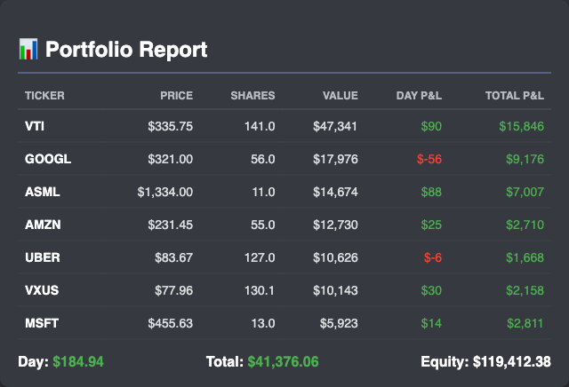

# 📈 Automated Portfolio Tracker

A full-stack Python automation tool that scrapes real-time financial data, tracks historical net worth, and delivers detailed visual reports to Discord.


*(Example of the daily generated report)*

## 🚀 Overview
I built this bot to automate the daily tracking of my investment portfolio across multiple assets (Stocks & ETFs). Instead of manually checking spreadsheets or apps, this system:
1.  **Scrapes** live market data using a headless browser.
2.  **Calculates** daily P&L and total equity based on my specific cost basis.
3.  **Persists** data to a SQLite database to build a historical trend line.
4.  **Visualizes** the data into a clean, dark-mode HTML report and a Line Graph.
5.  **Delivers** the analysis to my phone via Discord Webhooks.

It is deployed via **GitHub Actions** to run automatically every day at market close (1:00 PM PST).

## 🛠️ Tech Stack
* **Language:** Python 3.10+
* **Automation:** Playwright (Headless Browser Automation)
* **Data Visualization:** Matplotlib (Trend Graphs) & HTML/CSS (Report Generation)
* **Database:** SQLite (Local data persistence)
* **CI/CD:** GitHub Actions (Daily Cron Job scheduling)
* **Alerting:** Discord Webhooks API

## ⚙️ How It Works
The system follows a linear pipeline:

1.  **Extract:** The `PortfolioManager` class launches a Chromium browser instance to scrape live price data from financial news sources.
2.  **Transform:** Raw data is cleaned, converted to float, and compared against hardcoded share counts and cost basis to calculate `Day Gain` and `Total Return`.
3.  **Load:** Successful scans are committed to `portfolio.db` for historical tracking.
4.  **Visualize:**
    * *Table:* An HTML template is rendered and screenshotted using Playwright.
    * *Graph:* Matplotlib queries the database to draw a time-series chart of Net Worth.
5.  **Notify:** Both images are uploaded to a private Discord channel.

## 📊 Sample Output
The bot generates two distinct assets per run:

### 1. The Financial Table
A pixel-perfect HTML render showing exact positions and daily moves.

### 2. The Wealth Graph
A historical trend line generated by filtering and aggregating database records.
*(Note: Requires `history_graph.png` in repo to view)*

## 🔧 Installation & Usage

**1. Clone the repository**
```bash
git clone [https://github.com/YOUR_USERNAME/portfolio-bot.git](https://github.com/YOUR_USERNAME/portfolio-bot.git)
cd portfolio-bot 
```

2. Install Dependencies
pip install -r requirements.txt
3. Set Environment Variables Create a .env file or export the variable in your terminal:

Bash

export DISCORD_WEBHOOK_URL="your_discord_webhook_url"
4. Run Manually

Bash

python portfolio_manager.py
🤖 Automation (GitHub Actions)
The project includes a .github/workflows/main.yml file that defines the cron schedule:

YAML

on:
  schedule:
    - cron: '0 21 * * 1-5' # Runs at 1:00 PM PST (Market Close) Mon-Fri
Built by Joel Aguilar
